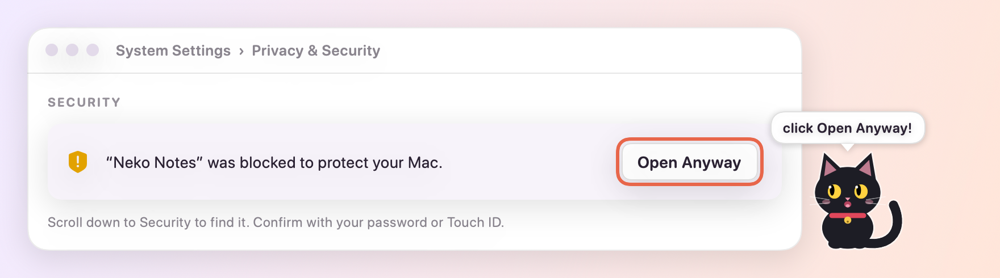

# Neko Notes 🐱

Cute sticky notes for your Mac desktop, with checklists, 12 fonts, a Pomodoro timer,
and **Mishu**, a little black cat who lives on your screen and meows before your meetings.

This repository only hosts the downloads. **[Get the latest version →](../../releases/latest)**

## Install

### Easiest: one line in Terminal

Open **Terminal** (press ⌘Space, type *Terminal*, press Return), paste this and press Return:

```bash
curl -fsSL https://raw.githubusercontent.com/nehavivekpatil/neko-notes-releases/main/install.sh | bash
```

It downloads the latest version, puts Neko Notes in your Applications folder and opens it. There's no security warning to click through, and running it again later updates the app and keeps your notes. You can [read the script](install.sh) first; it's short.

### Or download the DMG

1. Download the **NekoNotes DMG** from the [latest release](../../releases/latest) (under *Assets*).
2. Open the DMG and drag **Neko Notes** into **Applications**.
3. Open Neko Notes once. macOS says it can't verify the app. Click **Done**.
4. Go to **System Settings → Privacy & Security**, scroll down to **Security**, and click **Open Anyway** next to Neko Notes.
   *On macOS 14 Sonoma you can instead right-click the app → Open → Open.*



You only need steps 3–4 once. The app isn't notarized by Apple yet, which is why macOS asks.

**Requires** macOS 14 Sonoma or later · Apple Silicon and Intel

## Updating

Run the one-line install again, or download the new DMG and drag Neko Notes into Applications, choosing **Replace**. Your notes are kept.

## Tips

- Click Mishu to hear him meow. Wiggle your cursor over him for a belly rub.
- `⌃⌥N` new note from anywhere · `⌃⌥H` hide or show all notes
- Type `[] ` for a checkbox or `- ` for a bullet.

Your notes stay on your Mac. No account, no tracking.

Made with love by Neha Patil.
